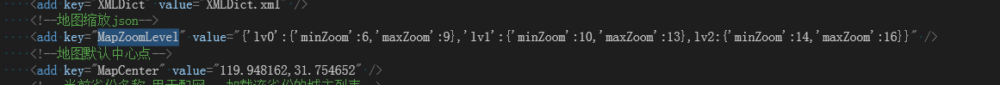
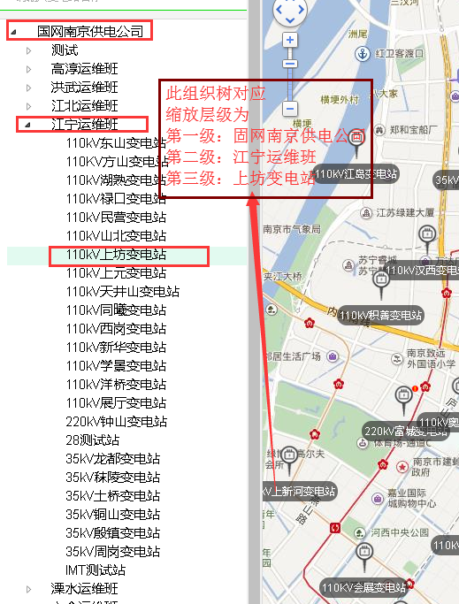

### map相关配置说明

-- [各省市区中心坐标 文档](../../tutorials/bmap_city.center.txt) **此文档存在于项目根目录 BaiduMap_cityCenter.txt**
-- 配置中心点 -->
  ````html
  1. 找到项目根目录 web.config
  2. 找到配置项 MapCenter 设置上述文档中查找到的坐标
  3. 找到配置项 MapZoomLevel 设置各组织对应的缩放级别(**精确到变电站这一级**) 
      比如组织树为 国网南京/南京/江宁运维班/展厅变电站  此为4级
      
      
  ````
