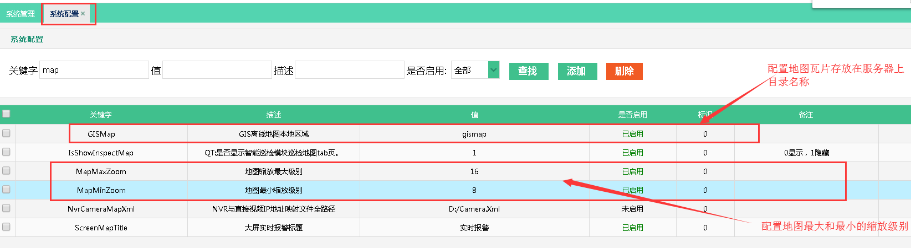

### map相关配置说明

-- [各省市区中心坐标 文档](../../tutorials/bmap_city.center.txt) **此文档存在于项目根目录 BaiduMap_cityCenter.txt**
-- 配置中心点 -->
  1. 找到系统配置表中 关键字为 **GISMap** 的配置项 配置 地图瓦片存放目录
  2. 找到系统配置表中 关键字为 **MapMaxZoom** 的配置项 配置 地图最大缩放级别
  3. 找到系统配置表中 关键字为 **MapMinZoom** 的配置项 配置 地图最小缩放级别
  4. 找到 web.config 配置项 MapCenter 设置上述文档中查找到的坐标
  5. 找到 web.config 配置项 MapZoomLevel 设置各组织对应的缩放级别(**精确到变电站这一级**) 
      比如下图中 组织结构(**国网南京供电公司/江宁运维班/110kV上坊变电站**) 与配置项的对应关系是
       1. 国网南京供电公司  对应 'lv0':{'minZoom':6,'maxZoom':9}
       2. 江宁运维班       对应 'lv1':{'minZoom':10,'maxZoom':13}
       3. 110kV上坊变电站  对应 'lv2':{'minZoom':14,'maxZoom':16}
       4. **组织层级依次向下对应配置项中 lv+数字(依次增加)**
       5. **组织层级下级的minZoom必须大于其上级的maxZoom**
       6. **lv0 的minZoom 必须等于系统配置项中 minZoom**
       7. **(组织层级最小一级，一般指变电站这一级) 的maxZoom 必须等于系统配置项中 maxZoom**
       
       
       
